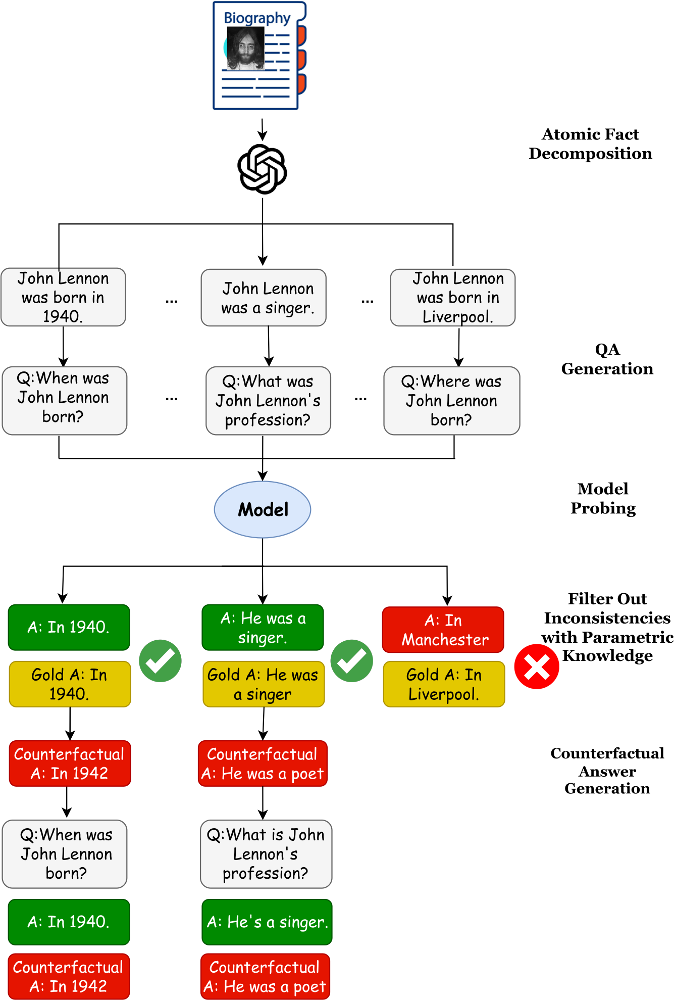
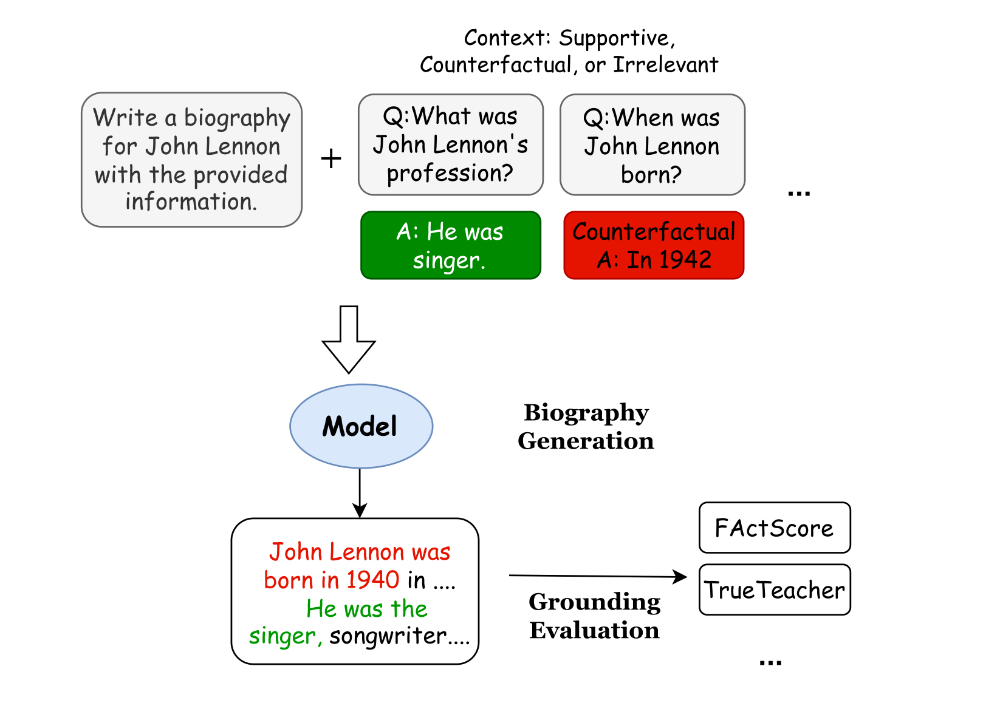

# Enhancing Knowledge Grounding in Retrieval-Augmented Languages Models
An ongoing MSc thesis project by Martin Fixman, supervised by Tillman Weyde.

## What is this about (for now)?
We are competing the grounding of different types of knowledge of many LLMs on several RAG models containing counterfactual information.

Better description to be completer later!





## Recommendations
Many of the models are large, and it might be useful to download them using the Huggingface CLI first.

For example,
```
$ huggingface-cli download --repo-type model 'facebook/rag-sequence-nq'
```

## Usage
```
$ python knowledge_grounder.py --help
usage: knowledge_grounder.py [-h] [--debug] [--lim-questions LIM_QUESTIONS] [--device {cpu,cuda}]
                             [--models model [model ...]] [--offline] [--rand]
                             [--max-batch-size MAX_BATCH_SIZE] [--per-model] [--output-dir OUTPUT_DIR]
                             [--runs-per-question RUNS_PER_QUESTION]
                             base_questions_file objects_file

Combines questions and data and optionally provides parametric data

positional arguments:
  base_questions_file   File with questions
  objects_file          File with objects to combine

options:
  -h, --help            show this help message and exit
  --debug               Go to IPDB console on exception rather than exiting.
  --lim-questions LIM_QUESTIONS
                        Question limit
  --device {cpu,cuda}   Inference device
  --models model [model ...]
                        Which model or models to use for getting parametric data
  --offline             Run offline: use model cache rather than downloading new models.
  --rand                Seed randomly rather thn using the same seed for every model.
  --max-batch-size MAX_BATCH_SIZE
                        Maximum size of batches. All batches contain exactly the same question.
  --per-model           Write one CSV per model in stdout.
  --output-dir OUTPUT_DIR
                        Return one CSV per model, and save them to this directory.
  --runs-per-question RUNS_PER_QUESTION
                        How many runs (with random counterfactuals) to do for each question.
```

## Example usage
```
$ python knowledge_grounder.py \
    --device cuda \ # Use CUDA (it's possible to use CPU for small models)
    --models llama flan-t5-xl flan-t5-xxl \ # List of models to try
    --output-dir outputs/ \ # Write outputs to this directory
    --rand \ # Randomly seed after every model. This will cause answers to vary from other runs.
    -- \
    data/base_questions.txt # File with {}-format base questions.
    data/objects.csv # File with objects.

$ python knowledge_grounder.py \
    --device cuda \ # Use CUDA (it's possible to use CPU for small models)
    --models llama-70b \ # This is a large model; let's run it separately.
    --max-batch-size 70 \ # Smaller batch size to ensure the program won't run out of VRAM.
    --output-dir outputs/ \ # Write outputs to this directory
    --offline \ # Run offline; this will fail if the model is not previously downloaded.
    -- \
    data/base_questions.txt # File with {}-format base questions.
    data/objects.csv # File with objects.
```

## Current list of models
```
$ python Models.py --list-models
     Model Name | Huggingface Model
----------------|-----------------------------------------
          llama | meta-llama/Meta-Llama-3.1-8B-Instruct
      llama-70b | meta-llama/Meta-Llama-3.1-70B-Instruct
     llama-405b | meta-llama/Meta-Llama-3.1-405B-Instruct
        flan-t5 | google/flan-t5-base
  flan-t5-small | google/flan-t5-small
   flan-t5-base | google/flan-t5-base
  flan-t5-large | google/flan-t5-large
     flan-t5-xl | google/flan-t5-xl
    flan-t5-xxl | google/flan-t5-xxl
          gemma | google/gemma-2-9b-it
      gemma-27b | google/gemma-2-27b-it
        falcon2 | tiiuae/falcon-11b
    falcon-180b | tiiuae/falcon-180b-chat
     falcon-40b | tiiuae/falcon-40b-instruct
      falcon-7b | tiiuae/falcon-7b-instruct
     distilbert | distilbert/distilbert-base-uncased-distilled-squad
        roberta | FacebookAI/roberta-base
  roberta-large | FacebookAI/roberta-large
  roberta-squad | deepset/roberta-base-squad2
        mixtral | mistralai/Mixtral-8x22B-Instruct-v0.1
          dummy |
```
